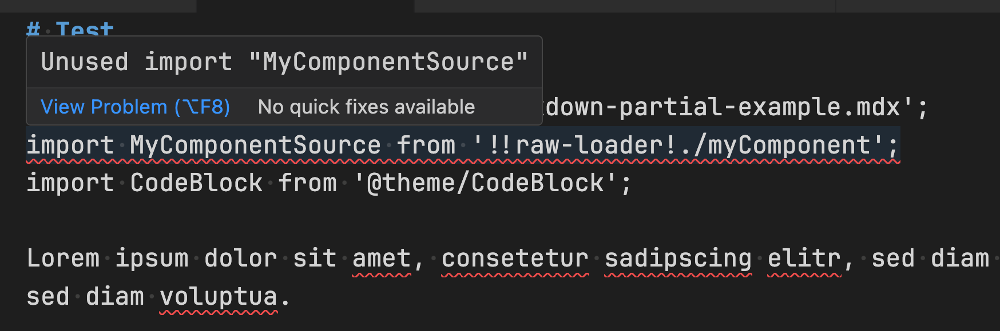

# Find Unused Imports in Markdown

This VS Code extension finds unused import statements in Markdown files and marks them as errors.

It's specifically designed to match the syntax of [Docusaurus import statements](https://docusaurus.io/docs/markdown-features/react#importing-markdown).

This means that all import statements without a matching XML tag on the page will be marked as errors.

## Example

When viewing the following Markdown sample in VS Code, the `MyComponentSource` import statement is marked as an error because it's never used.

```md
import PartialExample from './_markdown-partial-example.mdx';  << this is fine
import MyComponentSource from '!!raw-loader!./myComponent';    << never used, error 
import CodeBlock from '@theme/CodeBlock'; << this is fine

Lorem ipsum dolor sit amet, consetetur sadipscing elitr, sed diam nonumy eirmod tempor invidunt ut labore et dolore magna aliquyam erat, sed diam voluptua.

<CodeBlock language="jsx">{MyComponentSource}</CodeBlock>

Stet clita kasd gubergren, no sea takimata sanctus est <PartialExample name="Sebastien" /> dolor sit amet. Lorem ipsum dolor sit amet, consetetur sadipscing elitr, sed diam nonumy eirmod tempor invidunt ut labore et dolore magna aliquyam erat, sed diam voluptua. 
```


